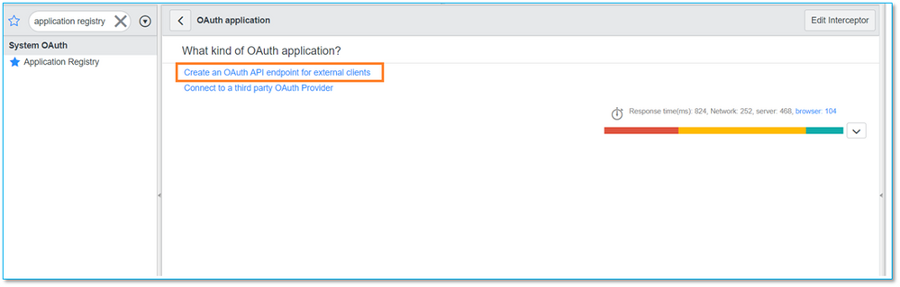
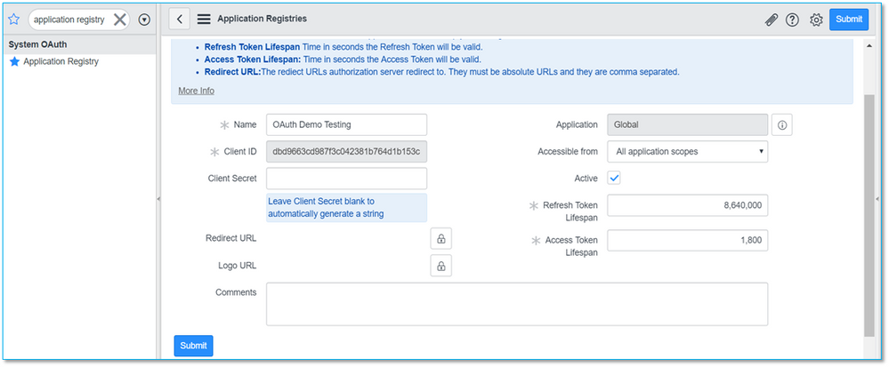
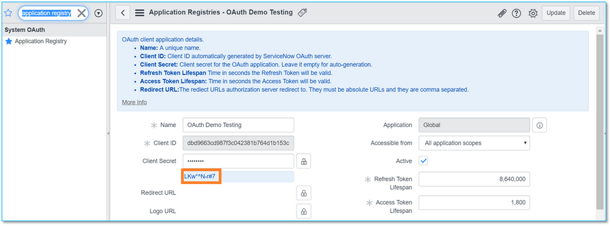
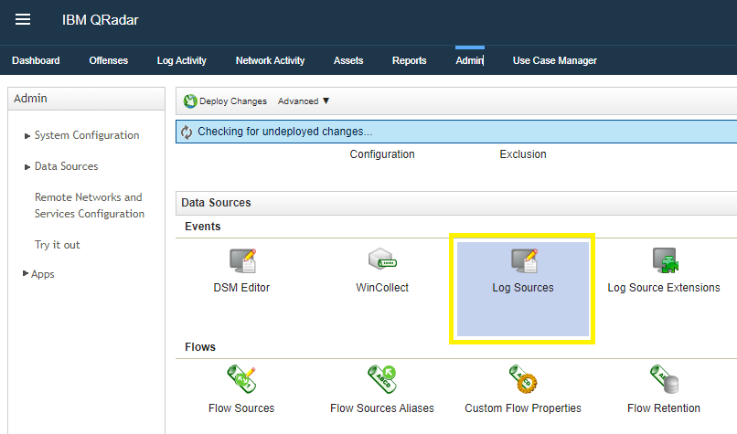
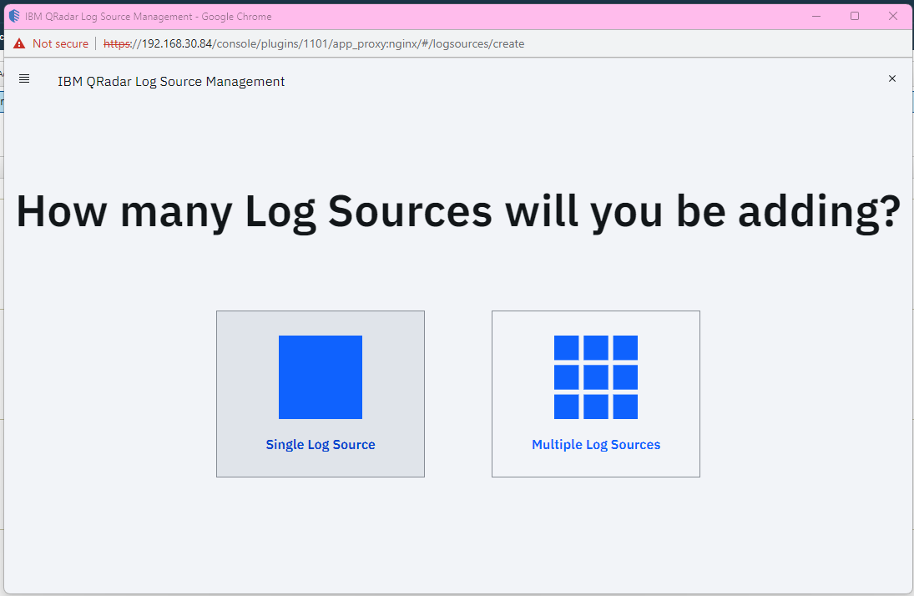
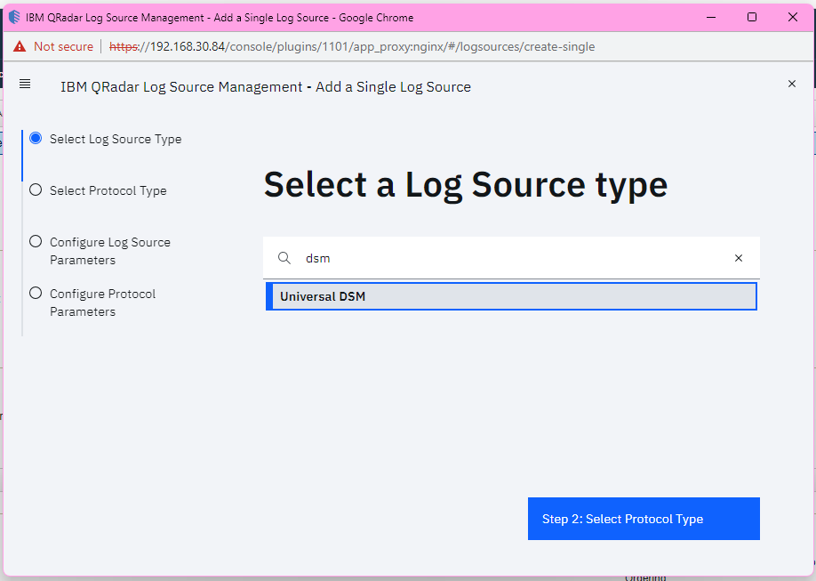
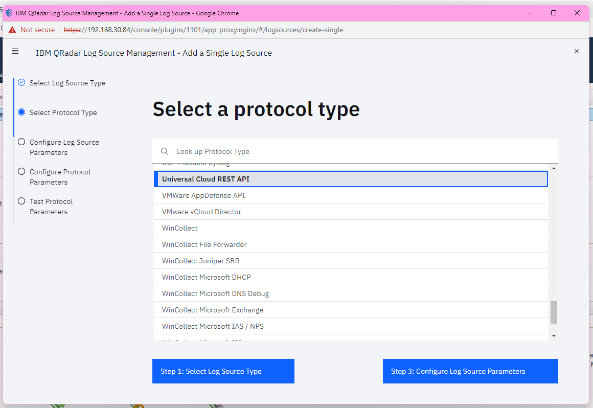
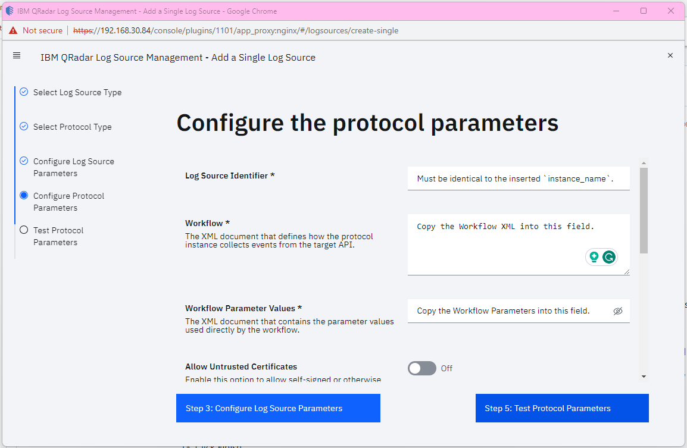
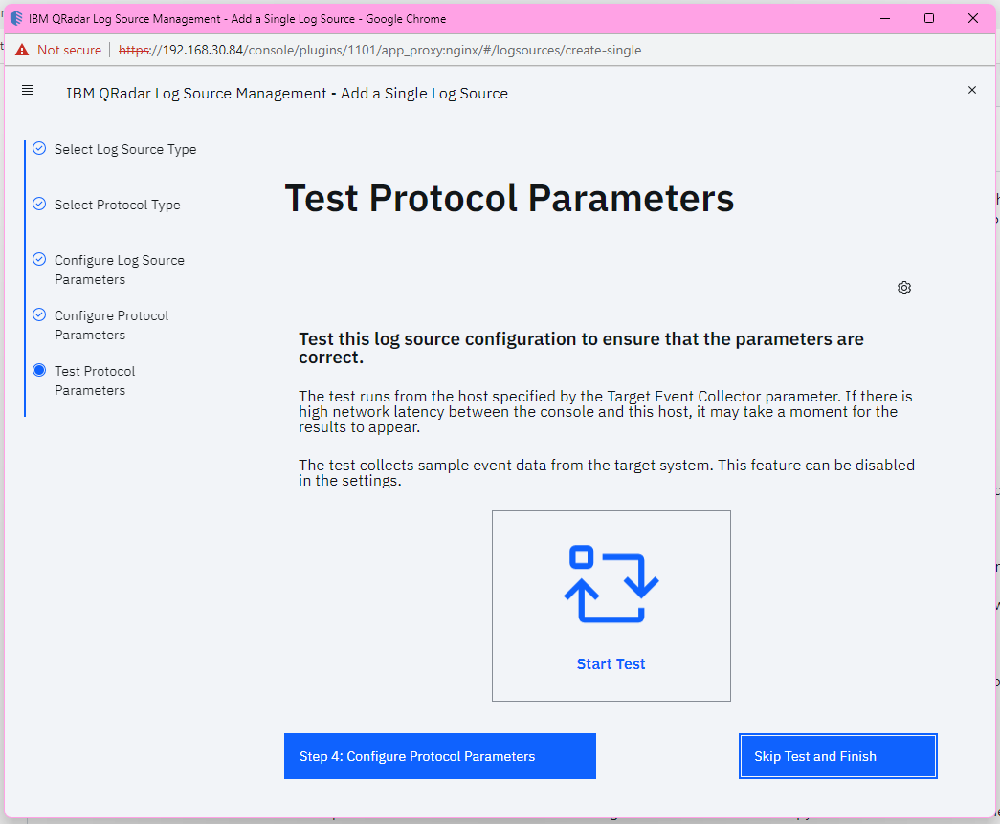

# ServiceNow Parameters Configuration
| Parameter                        | Name                                    | Required (True/False) | Type            | Description                                                                                           | Default Value |
|----------------------------------|-----------------------------------------|-----------------------|-----------------|-------------------------------------------------------------------------------------------------------|---------------|
| `identifier`                     | Log Source Identifier                   | True                  | String          | The log source identifier to post the events to.                                                     |               |
| `instance_name`                       | Instance Name                               | True                  | String          | ServiceNow instance name.                                                                                  |  |
| `client_id`                      | Client ID                        | True                  | Authentication  | ServiceNow client ID. |               |
| `client_secret`                  | Client Secret                              | True                  | Authentication  | ServiceNow client secret. |               |
| `username`                      | Username                        | True                  | Authentication  | ServiceNow user name. |               |
| `password`                  | Password                              | True                  | Authentication  | ServiceNow password. |               |
| `time_zone`                      | Time Zone                               | False                 | String          | The timezone used in ServiceNow.                                                                      | `UTC`         |
| `events_per_fetch`                | Events Per Fetch                         | False                 | Number          | Max number of records to return per fetch. Note: a large fetch may cause timeout errors.               | `100`         |
| `initial_fetch_period`     | Initial Event Fetch Period in Days      | False                 | Number          | Number of days in the past from which events will be initially retrieved.                            | `7`           |
| `table_to_fetch`                   | Table to Fetch                            | False                 | String          | Table name to fetch events from.                                                        |  |
| `pagination_time_field`                | Pagination Time Field | False                 | String          | The updated time field name (according to the table field name) for pagination.                          | `sys_updated_on` |
| `sleep_time_in_seconds`                | Sleep Time in Seconds | False                 | Number          | The downtime for the connector after it is in sync with the server (Min: 0).                          | `20` |

# How to Generate Client ID and Client Secret
1. Log on to your ServiceNow instance through: https://`instance_name`.service-now.com.

2. Navigate to "Application Registry" (System OAuth > Application Registry).

3. Click on "New" and select "Create an OAuth API endpoint for external clients".

4. Fill out the form according to your requirement and click "Submit".

5. Now you can see your Client ID and Client Secret.

# QRadar Log Source Configuration
If you want to ingest data from an endpoint using Universal Rest API Protocol, configure a log source on the QRadar® Console using the Workflow field so that the defined endpoint can communicate with QRadar by using the Universal Rest API protocol.

1. Log in to QRadar.

2. Click the Admin tab.

3. To create DSM, click the DSM editor app icon.

4. Then click Create New and name it "ServiceNow API".

4. To create the log source, click the QRadar Log Source Management app icon.

5. Click New Log Source > Single Log Source.

6. On the Select a Log Source Type page, Select a Log Source Type ServiceNow API and click Select Protocol Type (Universal Rest API).

7. On the Select a Protocol Type page, select a protocol and click Configure Log Source Parameters.

8. On the Configure the Log Source parameters page, configure the log source parameters and click Configure Protocol Parameters.

9. On the Configure the Protocol Parameters page, configure the protocol-specific parameters (Workflow and Workflow Parameter Values).

10. In the Test protocol parameters window, click Start Test.

10. To fix any errors, click Configure Protocol Parameters. Configure the parameters and click Test Protocol Parameters.

11. Click Finish

- The log source identifier must be identical to the inserted `instance_name`.
- Copy the Workflow XML into the Workflow field.
- Populate the Workflow Parameters according to the table above and copy it into the Workflow Parameters Values field.
- Make sure to turn off the Coalescing Events to avoid grouping of the events on the basis of Source and Destination IP.
- It is advised to open an individual log source for report types that fetch large amount of data.
